# Transaction Management System

A comprehensive transaction management system built with **Domain-Driven Design (DDD)**, **CQRS (Command Query Responsibility Segregation)**, and *
*Hexagonal Architecture** principles using Spring Boot.

## 🏗️ Architecture Overview

This project implements a clean architecture following these key patterns:

- **Domain-Driven Design (DDD)**: Business logic is encapsulated in the domain layer with clear boundaries
- **CQRS Pattern**: Separates command operations (write) from query operations (read) for better scalability and maintainability
- **Hexagonal Architecture**: Isolates the core business logic from external concerns through ports and adapters
- **Clean Architecture**: Dependency inversion ensures that domain logic doesn't depend on infrastructure details

### 🎯 Architecture Diagram

```mermaid
graph TD
%% External Systems
    Client["`🌐 **Client**<br/>REST API Calls`"]
%% Adapter Layer - Inbound
    subgraph Adapters["`🔌 **ADAPTER LAYER**`"]
        subgraph InboundAdapters["`📥 **Inbound Adapters**`"]
            Controller["`🎮 **TransactionController**<br/>REST Endpoints`"]
            DTOs["`📋 **Request DTOs**<br/>CreateTransactionRequestDTO<br/>UpdateTransactionRequestDTO`"]
            GlobalExceptionHandler["`🚨 **GlobalExceptionHandler**<br/>Error Handling`"]
        end

        subgraph OutboundAdapters["`📤 **Outbound Adapters**`"]
            RepoImpl["`💾 **MemoryTransactionRepository**<br/>Data Persistence`"]
        end
    end

%% Application Layer - CQRS
    subgraph Application["`💼 **APPLICATION LAYER - CQRS**`"]
        subgraph Commands["`⚡ **Command Side (Write)**`"]
            CommandUseCase["`📝 **TransactionCommandUseCase**<br/>Create, Update, Delete`"]
        end

        subgraph Queries["`🔍 **Query Side (Read)**`"]
            QueryUseCase["`📊 **TransactionQueryUseCase**<br/>Get, List, Search`"]
            PageDTO["`📄 **Page DTO**<br/>Pagination Support`"]
        end
    end

%% Domain Layer - DDD
    subgraph Domain["`🏛️ **DOMAIN LAYER - DDD CORE**`"]
        subgraph DomainModel["`📦 **Domain Model**`"]
            TransactionEntity["`💰 **Transaction Entity**<br/>Core Business Logic<br/>- Validation Rules<br/>- Business Invariants`"]

            subgraph CommandObjects["`📝 **Command Objects**`"]
                CreateCommand["`➕ **CreateTransactionCommand**`"]
                UpdateCommand["`✏️ **UpdateTransactionCommand**`"]
            end
        end

        subgraph DomainPorts["`🔗 **Domain Ports/Interfaces**`"]
            RepoInterface["`📊 **TransactionRepository**<br/>Port Interface`"]
        end
    end

%% Configuration & Common
    subgraph Infrastructure["`⚙️ **INFRASTRUCTURE**`"]
        Config["`🔧 **Configuration**<br/>CacheConfig<br/>OpenApiConfig`"]
        CommonExceptions["`🛠️ **Common Components**<br/>Shared Exceptions`"]
    end

%% External Storage
    Memory["`🗃️ **In-Memory Storage**<br/>Transaction Data`"]
%% Connections
    Client --> Controller
    Controller --> DTOs
    Controller --> CommandUseCase
    Controller --> QueryUseCase
    Controller --> GlobalExceptionHandler
    CommandUseCase --> CreateCommand
    CommandUseCase --> UpdateCommand
    CommandUseCase --> TransactionEntity
    CommandUseCase --> RepoInterface
    QueryUseCase --> TransactionEntity
    QueryUseCase --> RepoInterface
    QueryUseCase --> PageDTO
    TransactionEntity --> CreateCommand
    TransactionEntity --> UpdateCommand
    RepoInterface -.-> RepoImpl
    RepoImpl --> Memory
%% Styling
    classDef adapterStyle fill: #e1f5fe, stroke: #0277bd, stroke-width: 2px
    classDef applicationStyle fill: #f3e5f5, stroke: #7b1fa2, stroke-width: 2px
    classDef domainStyle fill: #fff3e0, stroke: #f57c00, stroke-width: 2px
    classDef infrastructureStyle fill: #e8f5e8, stroke: #388e3c, stroke-width: 2px
    classDef externalStyle fill: #ffebee, stroke: #d32f2f, stroke-width: 2px
    class Adapters,InboundAdapters,OutboundAdapters adapterStyle
    class Application,Commands,Queries applicationStyle
    class Domain,DomainModel,DomainPorts domainStyle
    class Infrastructure infrastructureStyle
    class Client,Memory externalStyle
```



## 📁 Project Structure

```
src/main/java/org/chen/sid/transactionmanagement/
├── TransactionManagementApplication.java     # 🚀 Main Spring Boot Application
├── adapter/                                  # 🔌 Hexagonal Architecture - Adapters Layer
│   ├── in/                                   # 📥 Inbound Adapters (Controllers)
│   │   └── exception/                        # 🚨 Global Exception Handlers
│   └── out/                                  # 📤 Outbound Adapters (Repository Implementations)
│       └── repo/                             # 💾 Repository Implementations
├── application/                              # 💼 Application Layer - Use Cases
│   ├── usecase/
│   │   ├── command/                          # ⚡ CQRS - Command Side (Write Operations)
│   │   │   └── dto/                          # 📋 Command DTOs
│   │   └── query/                            # 🔍 CQRS - Query Side (Read Operations)
│   │       └── dto/                          # 📄 Query DTOs
│   └── validator/                            # ✅ Request Validation
├── common/                                   # 🛠️ Shared Components
│   └── exception/                            # 🚨 Common Exception Classes
│       └── basic/                            # 🔧 Base Exception Classes
├── config/                                   # ⚙️ Configuration Classes
└── domain/                                   # 🏛️ Domain Layer - Core Business Logic
    ├── infrastructure/                       # 🔗 Domain Ports/Interfaces
    └── model/                                # 📦 Domain Models
        ├── command/                          # 📝 Command Objects (DDD Commands)
        └── entity/                           # 🏢 Domain Entities
```

## 🏗️ Architecture Layers Explained

### 🔌 Adapter Layer (`adapter/`)

**Purpose**: Implements the ports defined by the domain layer and handles external communication.

- **`in/`**: **Inbound Adapters** - Handle incoming requests (REST Controllers)
    - `exception/`: Global exception handling for web layer

- **`out/`**: **Outbound Adapters** - Handle outgoing calls (Database, External APIs)
    - `repo/`: Repository implementations for data persistence

### 💼 Application Layer (`application/`)

**Purpose**: Orchestrates domain objects and implements application-specific business rules through use cases.

- **`usecase/command/`**: **Command Side (CQRS)** - Handles write operations (Create, Update, Delete)
    - `dto/`: Command-specific Data Transfer Objects

- **`usecase/query/`**: **Query Side (CQRS)** - Handles read operations (Get, List, Search)
    - `dto/`: Query-specific Data Transfer Objects (pagination, response models)

- **`validator/`**: **Request Validation** - Common validation logic for request parameters

### 🏛️ Domain Layer (`domain/`)

**Purpose**: Contains the core business logic, entities, and domain rules. This is the heart of the application.

- **`model/entity/`**: Core business entities with business logic and invariants
- **`model/command/`**: Command objects representing business intentions
- **`infrastructure/`**: Ports (interfaces) that define contracts for external dependencies

### ⚙️ Config Layer (`config/`)

**Purpose**: Spring configuration classes for application setup (cache, OpenAPI documentation).

### 🛠️ Common Layer (`common/`)

**Purpose**: Shared utilities and exceptions used across layers.

- **`exception/basic/`**: Base exception classes for the application
- **Exception Classes**: Specific exception types for different error scenarios

## 🔄 CQRS Implementation

The system separates **Commands** (write operations) from **Queries** (read operations):

### Commands (Write Side)

- `TransactionCommandUseCase`: Handles CREATE, UPDATE, DELETE operations
- Uses `CreateTransactionCommand` and `UpdateTransactionCommand` for business intentions
- Ensures data consistency and business rule validation

### Queries (Read Side)

- `TransactionQueryUseCase`: Handles READ operations (Get by ID, List all, Pagination)
- Optimized for read performance
- Can be independently scaled and cached

## 🌐 API Endpoints

The Transaction Management API provides RESTful endpoints for managing financial transactions:

### Base URL: `/api/v1/transactions`

| Method   | Endpoint | Description                             | Status Code    |
|----------|----------|-----------------------------------------|----------------|
| `POST`   | `/`      | Create a new transaction                | 201 Created    |
| `GET`    | `/{id}`  | Get transaction by ID                   | 200 OK         |
| `PUT`    | `/{id}`  | Update existing transaction             | 200 OK         |
| `DELETE` | `/{id}`  | Delete transaction by ID                | 204 No Content |
| `GET`    | `/`      | List all transactions (with pagination) | 200 OK         |

### 📋 Request/Response Examples

**Create Transaction:**

```json
POST /api/v1/transactions
{
  "name": "Coffee Purchase",
  "amount": 4.50
}
```

**Update Transaction:**

```json
PUT /api/v1/transactions/{
  id
}
{
  "name": "Updated Coffee Purchase",
  "amount": 5.00
}
```

**List Transactions with Pagination:**

```
GET /api/v1/transactions?page=1&size=10
```

### 🏷️ Transaction Entity Structure

```json
{
  "id": "uuid-string",
  "name": "Transaction Name",
  "amount": 99.99,
  "createTime": "2024-01-15T10:30:00",
  "updateTime": "2024-01-15T10:30:00"
}
```

## 📦 Dependencies

### 🏗️ Core Framework

- **Spring Boot 3.5.5**: Main application framework
- **Java 21**: Programming language version

### 🌐 Web & API

- **spring-boot-starter-web**: RESTful web services
- **spring-boot-starter-validation**: Request validation
- **springdoc-openapi-starter-webmvc-ui 2.8.5**: OpenAPI 3 documentation and Swagger UI

### 🗂️ Data & Caching

- **spring-boot-starter-cache**: Caching abstraction

### 📊 Monitoring & Health

- **spring-boot-starter-actuator**: Production monitoring and management

### 🔧 Development Tools

- **Lombok**: Reduces boilerplate code with annotations
- **Maven**: Build and dependency management tool

### 🧪 Testing

- **spring-boot-starter-test**: Spring Boot testing framework
- **AssertJ 3.27.3**: Fluent assertion library
- **REST Assured 5.5.6**: REST API testing framework

## 🚀 Running the Application

### 📋 Prerequisites

- Java 21 or higher
- Maven 3.6+ (or use the included `mvnw`)

### 🏃‍♂️ Local Development

```bash
# Using Maven wrapper (recommended)
./mvnw spring-boot:run

# Using Maven
mvn spring-boot:run

# Running the JAR directly
./mvnw clean package
java -jar target/TransactionManagement-0.0.1-SNAPSHOT.jar
```

### 🐳 Docker

```bash
# Build and run with Docker
docker build -t transaction-management .
docker run -p 8080:8080 transaction-management

# Using Docker Compose
docker-compose up --build
```

### Kubernetes

```bash
# Create Namespace
kubectl create namespace transaction-management
# Apply Configs
kubectl apply -k k8s/
```

### 🔍 Access Points

- **Application**: http://localhost:8080
- **API Documentation**: http://localhost:8080/swagger-ui/index.html
- **Health Check**: http://localhost:8080/actuator/health

## 🧪 Testing

```bash
# Run all tests
./mvnw test

# Run specific test class
./mvnw test -Dtest=TransactionControllerTest

# Run integration tests
./mvnw test -Dtest=TransactionIntegrationTest
```

## ⚡ Performance Testing

### 📊 Test Environment

- **Runtime Environment**: Docker Container
- **Hardware Configuration**:
    - CPU: 4 Cores (Apple M3 Pro)
    - Memory: 2GB RAM
- **Testing Tool**: Postman

### 🚀 Quick Start

1. **Import Postman Scripts**:
   ```bash
   # Import test collection
   performance-test/transaction-management-performance-testing-postman.json
   
   # Import environment configuration
   performance-test/transaction-management-performance-testing-postman-env.json
   ```

2. **Start Application**:
   ```bash
   # Launch application using Docker Compose
   docker-compose up --build
   ```

3. **Execute Performance Tests**:
    - Select the imported environment configuration in Postman
    - Run performance test scenarios from the test collection
    - Monitor application performance and resource usage

### 📋 Test Results

For detailed performance test reports and analysis, please refer to:

- **Complete Report**: [Transaction-Management-Performance-Report.pdf](performance-test/Transaction-Management-Performance-Report.pdf)
- **Resource Usage**: [Docker-Resource-Usage.png](performance-test/Docker-Resource-Usage.png)

The test report contains comprehensive analysis of detailed performance metrics, response time analysis, throughput statistics, and system resource
utilization.

## 📈 Benefits of This Architecture

1. **🔄 Separation of Concerns**: Each layer has a specific responsibility
2. **🧪 Testability**: Easy to unit test business logic in isolation
3. **🔌 Flexibility**: Easy to swap implementations (e.g., change from in-memory to database storage)
4. **📈 Scalability**: CQRS allows independent scaling of read and write operations
5. **🛡️ Maintainability**: Clear boundaries make the code easier to understand and modify
6. **🚀 Performance**: Caching and query optimization on the read side

## 🚀 Areas for Improvement

While the current implementation demonstrates solid architectural principles, there are several areas that could be enhanced for production readiness and scalability:

1. **🔐 Authentication and Frontend Integration** - Add authentication mechanisms, role-based access control, and develop frontend interaction logic for a complete user experience.

2. **⚡ Database Concurrency Optimization** - The current coarse-grained read-write locks can become a bottleneck under high concurrency, requiring fine-grained locking strategies for better performance.

3. **🗄️ Complete CQRS Database Segregation** - Due to memory store limitations, CQRS pattern is not fully realized at the database layer, preventing independent scaling of read and write operations.

## 🏷️ Version

- **Current Version**: 0.0.1-SNAPSHOT
- **Spring Boot Version**: 3.5.5
- **Java Version**: 21
